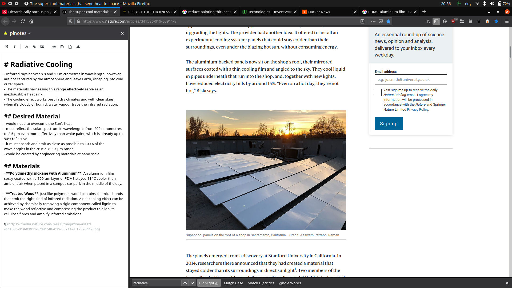

# pinotes-browser-ext
The extension adds a sidebar to your Firefox to take notes easily. It uses [pinotes](https://github.com/quaintdev/pinotes) as a backend. The server address can be specified [here](https://github.com/quaintdev/pinotes-browser-ext/blob/2cc96bf99059a34cfe9bd0233dc7b3b7ab96137f/sidebar/panel.js#L1).

